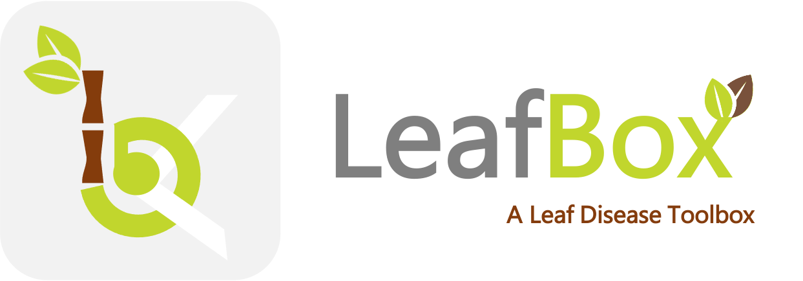

I'm working from home   
</img>

&nbsp; &nbsp; &nbsp; &nbsp; &nbsp; &nbsp; &nbsp;  

<h1 align="center">Hi there </h1>

### :woman_technologist: &nbsp; About Me :

I'm ***Francesca***, I've a Ph.D. in Computer Science.

My research currently focus on *Predictive Analytics*, *Deep Learning* and *Decision Support Systems* applied to Precision Agriculture and Economics sectors. I’m involved in the LANDS project, a prototype Decision Support System for Precision Agriculture. 

if you are interested in forecasting plant disease using deep learning, maybe you can find useful my Leaf Box toolbox, and the DiaMOS dataset that I have developed during my Ph.D. 👇

&nbsp;

<a href="https://github.com/mallociFrancesca/leaf-disease-toolbox"> **Leaf Disease Toolbox**   </a>

<a href="https://www.mdpi.com/1322548"> **DiaMOS Plant Dataset**   </a>

&nbsp;

Please feel free to contact me. I will be happy to start new research collaborations :smile:

&nbsp;
---

### 🛠 &nbsp;Languages and Tools :

&nbsp;&nbsp;
&nbsp;&nbsp;&nbsp;&nbsp;&nbsp;&nbsp;&nbsp;&nbsp;&nbsp;&nbsp;&nbsp;&nbsp;

---
